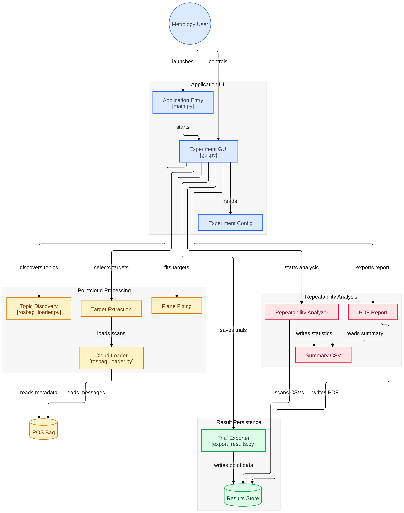
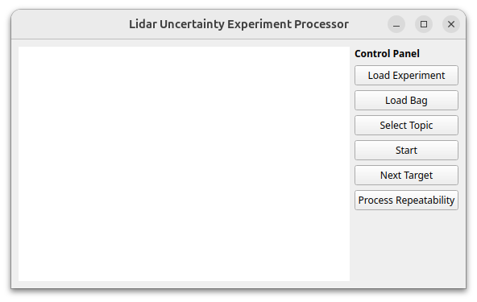
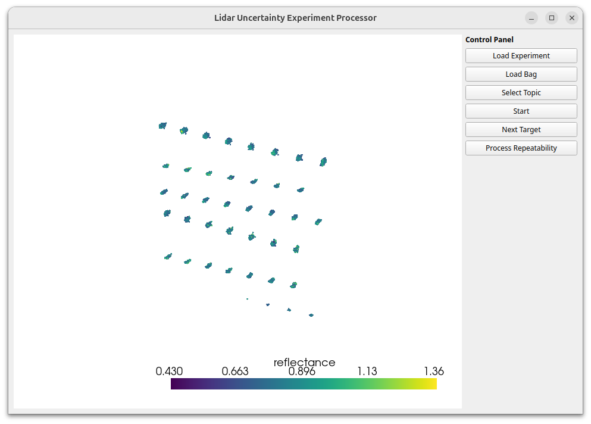

# Pointcloud Target Processing

A python package to extract planar target points from a pointcloud for automotive lidar metrology studies, calculate experiment repeatability, and evaulate the effect of adverse weather on lidar range statistics.

## Architecture

Point cloud pre-processing and statistics calculation is controlled by `gui.py`, which starts a PyQt application with PyVista graphing embedded for point cloud visualization. The accompanying diagram was generated with [gitdiagram.com](gitdiagram.com)



## Installation

Clone the package:

```
$ git clone https://github.com/Robust-Autonomous-Systems-Laboratory/lidar-uncertainty-modeling.git
```

### Required packages

Make a new virtual env and source it:
```
$ cd lidar-uncertainty-modelling
$ python3 -m venv ./lidar_venv
$ source lidar_venv/bin/activate
```

Install dependencies from `requirements.txt`:
```
$ pip install -r requirements.txt
```

## Usage

Launch the GUI by running `main.py`

```
$ cd lidar-uncertainty-modelling
$ python3 main.py
```



### Experiment Configuration File
This application works off an experiment configuration file created by the practioner to define the test field. This defines planar target locations, sizes, reflectivities, etc. and is necessary for the processor to properly iterate through all targets.

Experiment descriptions are YAML files located in `/cfg`. An example is located in [`/cfg/test1_target_locations.yaml`](/cfg/test1_target_locations.yaml)

When ready to process lidar data, select the experiment you wish to process by selecting the "Load Experiment" button.

### Load Bag Data
At present, this app only processes ROS1 bag files. Select which bag to extract points from by selecting the file from the "Load Bag" button. 

### Select Topic
Some bags have multiple [PC2](https://docs.ros.org/en/noetic/api/sensor_msgs/html/msg/PointCloud2.html) message types. Select the correct topic you wish to extract points from and process.

### Start Processing
Once all details are set, select the "Start" button to begin target planar processing. Iterative Recursive Least Squares (IRLS) is used to remove noisy target points and trim the outer edges of the planar target surface area due to range binning errors caused by sharp edges. When processing is complete, the accumulated target points for the selected bag are displayed on the left for visual confirmation.



### Next Target
If the target appears correct, select "Next Target" to save target information.

If you have additional targets in the experiment, the next target will be processed. Otherwise, a message indicating all targets are processed will appear.

### Process Repeatability
When all bag files for a given experiment are processed, select the "Process Repeatability" button to generate a repeatability report that evaluates Type A uncertainties for each lidar. A PDF report is stored in `/results`.

An example of this report is located here: [`/results/june_26_2026_laser_rangefinderlidar_repeatability_summary.pdf`](./results/june_26_2026_laser_rangefinderlidar_repeatability_summary.pdf)

## To Do
Several functional updates are planned for the future of this processing application, including:

- Automated iteration through all bags for a given experiment
- Robust user interfacce to catch out-of-order errors
- Expanded data input types, including bag2 and PCDs
- Option of including user inputted Type B uncertainty to the repeatability report
- Addition of processing data with an additional variable (i.e. weather) and conduct a t-test against the repeatability report

## Related
This processing pipeline __supercedes__ an initial experiment processing architecture, located at https://github.com/Robust-Autonomous-Systems-Laboratory/open-lidar-evaluation

## Acknowledgement
This work is supported by the United States National Institute of Standards and Technology (NIST) Grant 60NANB24D227.

## Contact

Ian Q. Mattson, iqmattso \<at\> mtu.edu